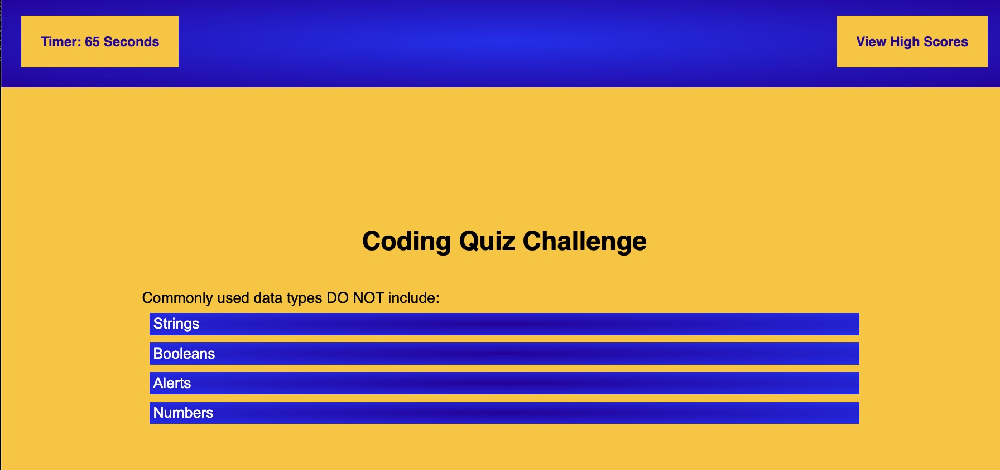

# Coding Quiz Study Aid

## Description

As a student in a coding bootcamp, there's a lot to keep straight! This quiz was designed to help a student remember some details about JavaScript. To make it more fun, the user can get a bunch of friends together, save their score, and then compare it to everyone else's score. 

I created two HTML files: one for the main body of the quiz that JavaScript then interacts with in order to give the quize; the other for the scoreboard. The HTML files are pretty bare and mainly just have divs with ids that can be called into the JavaScript file. The JavaScript does all the functionality for the page including a timer, question rendering, checking answers, keeping score, and navigating from one aspect to the next. It also clears the timer and stores items in storage to be retrieved later. 

Some styling occurs in the JavaScript (mainly for the elements created in the JavaScript). Main page styling occurs in the CSS. Like the style in JavaScript, some script functionality is built into the highscores.html page because I had less script to include in that file it isn't as complicated as the quiz itself. 

## Screenshot

## Link

https://cmckee120993.github.io/coding-study-aid/